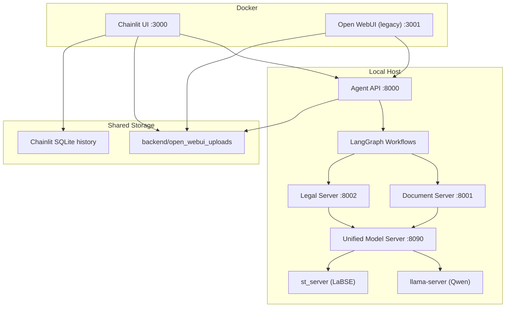

# Agent Navigator Pro

**Agent Navigator Pro** — агентная система для анализа документов, RAG-поиска, сравнения юридических актов и проверки соответствия ТЗ/КП. Основной пользовательский интерфейс проекта сейчас — **Chainlit** на порту `3000`. **Open WebUI** оставлен как legacy-вариант и запускается отдельным docker profile на порту `3001`.

## Архитектура

Система разделена на два слоя:

- Docker UI: `chainlit-ui`
- Host backend: `agent_api`, `document_server`, `legal_server`, `unified_model_server`



## Основные компоненты

| Компонент | Технология | Порт | Роль |
| --- | --- | --- | --- |
| `chainlit-ui` | Docker + Chainlit | `3000` | Основной интерфейс чата, history, шаги workflow, загрузка файлов |
| `open-webui` | Docker + Open WebUI | `3001` | Legacy UI, запускается только через `--profile legacy` |
| `agent_api` | FastAPI | `8000` | OpenAI-compatible entrypoint, маршрутизация в workflow |
| `document_server` | FastAPI | `8001` | Парсинг PDF/DOCX, OCR, таблицы, чанки |
| `legal_server` | FastAPI | `8002` | Batch matching и сравнение юридических документов |
| `UMS` | FastAPI | `8090` | Управление моделями, `/infer`, `/v1/embeddings`, startup/fallback |
| `llama-server` | llama.cpp | dynamic | Генерация LLM-ответов |
| `st_server` | SentenceTransformers | `8093` | Embeddings для LaBSE |

## Что умеет система

- обычный чат с локальной LLM
- RAG-вопросы по загруженным документам
- `document_analysis` для одиночного документа
- `compare_documents` для двух юридических документов
- `equipment_analysis` для ТЗ, смет и коммерческих предложений
- сохранение markdown-отчётов в [`backend/open_webui_uploads`](backend/open_webui_uploads)

## Быстрый старт

### 1. Требования

- Linux
- NVIDIA GPU и CUDA для основного LLM-path
- Docker и Docker Compose
- Conda или совместимое Python 3.11 окружение

### 2. Установка backend-зависимостей

```bash
cd backend
pip install -r requirements.txt
```

Если используешь `conda`:

```bash
conda create -n diploma_llm python=3.11
conda activate diploma_llm
cd backend
pip install -r requirements.txt
```

### 3. Настройка `.env`

```bash
cd backend
cp .env.example .env
```

После этого проверь пути к моделям и сервисные переменные в `backend/.env.example`.

### 4. Запуск системы

Рекомендуемый полный запуск:

```bash
./scripts/run_all.sh
```

Скрипт:

- поднимает `tmux`-сессию `agent-navigator`
- запускает `agent_api`, `document_server`, `legal_server`, `UMS`
- поднимает `chainlit` через `docker compose`

### 5. Отдельный запуск Chainlit

Если backend уже работает:

```bash
docker compose up -d chainlit
docker compose logs --tail=200 -f chainlit
```

UI будет доступен на:

- `http://localhost:3000`

Legacy Open WebUI при необходимости:

```bash
docker compose --profile legacy up -d open-webui
```

Он будет доступен на:

- `http://localhost:3001`

## Типовые сценарии

### RAG-вопрос по документу

1. Загрузи файл в Chainlit
2. Задай вопрос вроде:
   `Какой гарантийный срок указан в документе?`

### Анализ одного документа

Задай:

```text
Проанализируй этот документ и кратко опиши его содержание.
```

### Сравнение двух юридических документов

Загрузи 2 файла и задай:

```text
Сравни эти два юридических документа и выдели ключевые различия.
```

### Сравнение ТЗ и коммерческого предложения

Загрузи 2 файла и задай:

```text
Сравни ТЗ и коммерческое предложение, проверь соответствие оборудования.
```

## Полезные команды

Полный backend test suite без integration:

```bash
cd backend
pytest tests/ -v -m "not integration"
```

Таргетные тесты по стабильности Chainlit/UMS:

```bash
pytest backend/tests/test_chainlit_streaming.py \
  backend/tests/test_unified_model_server_streaming.py \
  backend/tests/test_unified_model_server_startup.py -q
```

Статус контейнеров:

```bash
docker compose ps
```

Логи Chainlit:

```bash
docker compose logs --tail=200 chainlit
```

Подключение к `tmux`:

```bash
tmux attach -t agent-navigator
```

## Текущее состояние UI и runtime

- основной UI: `Chainlit`
- direct chat сейчас работает в **non-stream** режиме как production-safe default
- `Open WebUI` сохранён как legacy path
- локализация `ru-RU`, `chainlit.md`, логотип и аватар теперь обслуживаются из repo-side ресурсов
- отчёты сохраняются в [`backend/open_webui_uploads`](backend/open_webui_uploads)

## Структура проекта

```text
.
├── backend/
│   ├── orchestrator/
│   │   ├── agent_api.py
│   │   ├── chainlit_app.py
│   │   ├── rag/
│   │   └── workflows/
│   ├── services/
│   │   ├── document_server/
│   │   ├── legal_server/
│   │   ├── model_manager/
│   │   └── hardware/
│   ├── tests/
│   ├── models/
│   └── open_webui_uploads/
├── docs/
├── scripts/
├── docker-compose.yaml
├── Dockerfile.chainlit
├── AGENTS.md
├── TASKS.md
└── README.md
```

## Где смотреть дальше

- backlog и техдолг: [`TASKS.md`](TASKS.md)
- правила работы по репозиторию: [`AGENTS.md`](AGENTS.md)
- модели: [`backend/models/README.md`](backend/models/README.md)
