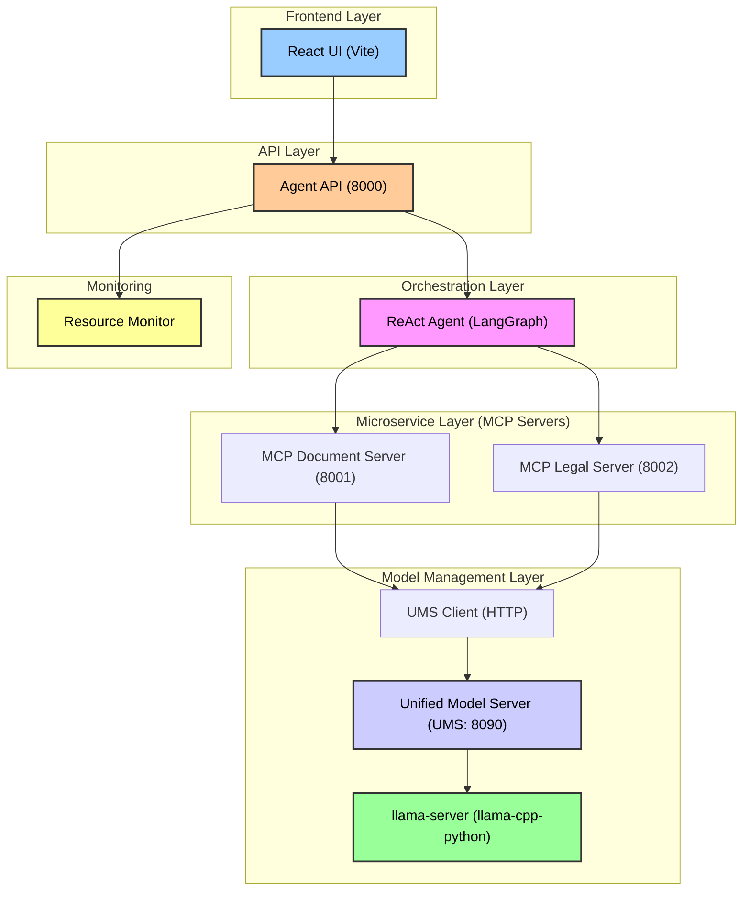

# Agent Navigator Pro

Agent Navigator Pro is a prototype demonstrating a microservice architecture for a document analysis agent system. It implements the **Unified Model Server (UMS)** concept for efficient resource management on a single machine.

This project uses **LangGraph** for orchestration, **FastAPI** for creating independent microservices (MCP servers), and **llama-cpp-python** for local model inference.

## Architecture

The system is divided into several layers, from the user-facing frontend to the model management backend.



### Key Components

| Component | Path | Port | Role |
| :--- | :--- | :--- | :--- |
| **React UI** | `src/` | - | User interface (chat, settings, monitoring) |
| **Agent API** | `react_agent_prototype/orchestrator/agent_api.py` | 8000 | FastAPI wrapper with SSE streaming for ReAct steps |
| **ReAct Agent** | `react_agent_prototype/orchestrator/react_agent_http.py` | - | Main orchestrator (LangGraph) |
| **Document Server** | `react_agent_prototype/services/document_server/mcp_document_server.py` | 8001 | Service for document operations (upload, chunking, OCR) |
| **Legal Server** | `react_agent_prototype/services/legal_server/mcp_legal_server.py` | 8002 | Service for legal analysis (comparison, change analysis) |
| **Resource Monitor** | `react_agent_prototype/services/resource_monitor.py` | - | Monitors VRAM, RAM, CPU, and CUDA |
| **UMS Client** | `react_agent_prototype/services/model_manager/ums_client.py` | - | HTTP client for the UMS |
| **UMS** | `react_agent_prototype/services/model_manager/unified_model_server.py` | 8090 | Manages model loading/unloading to optimize VRAM |

## Features

- **Real-time Agent Streaming**: SSE streaming displays ReAct steps (Thought → Action → Observation) in the UI.
- **Resource Monitoring**: Tracks VRAM, RAM, and CPU usage via `psutil` and `pynvml`.
- **Dynamic Model Management (UMS)**: Loads and unloads models on demand to conserve VRAM.
- **Flexible Operating Modes**: Supports GPU, CPU, and Hybrid modes (`--n_gpu_layers`) to adapt to different hardware.

## Requirements

- Python 3.11+
- Node.js 18+
- NVIDIA GPU with CUDA (recommended: RTX 3060 12GB or higher)

## Installation

For detailed installation instructions, please refer to [INSTALLATION.md](INSTALLATION.md).

**Quick Start:**

```bash
# Backend
cd react_agent_prototype
python3.11 -m venv venv
source venv/bin/activate
pip install -r requirements.txt

# Frontend
cd ..
npm install
```

## Running the Application

### 1. Start the Backend Services

You can run all services manually in separate terminals or use the provided script.

**Manual Startup:**

```bash
# Terminal 1: Agent API (Main Server)
cd react_agent_prototype/orchestrator
uvicorn agent_api:app --host 0.0.0.0 --port 8000

# Terminal 2: Document Server
cd react_agent_prototype/services/document_server
uvicorn mcp_document_server:app --host 0.0.0.0 --port 8001

# Terminal 3: Legal Server
cd react_agent_prototype/services/legal_server
uvicorn mcp_legal_server:app --host 0.0.0.0 --port 8002

# Terminal 4: Unified Model Server (UMS)
cd react_agent_prototype/services/model_manager
python unified_model_server.py
```

**Automated Startup (via tmux):**

```bash
cd react_agent_prototype
./run_all.sh
```

### 2. Start the Frontend

```bash
# From the project root
npm run dev
```

## API Endpoints

The main **Agent API** is available at `http://localhost:8000`.

| Method | Endpoint | Description |
| :--- | :--- | :--- |
| GET | `/health` | Check the status of all connected services. |
| GET | `/status` | Get resource information (VRAM, RAM, CPU, CUDA). |
| POST | `/agent/chat` | Send a query to the agent. |
| GET | `/agent/stream/{session_id}` | Stream ReAct agent steps via SSE. |

### Example Usage

```bash
# Check service health
curl http://localhost:8000/health

# Send a request to the agent
curl -X POST http://localhost:8000/agent/chat \
  -H "Content-Type: application/json" \
  -d '{"query": "Load the document /tmp/test.pdf"}'
```

## Model Configuration

Models are configured via environment variables. Place your models in the `react_agent_prototype/models` directory and set the paths.

```bash
export MODEL_PATH_QWEN14B="./models/Qwen2.5-14B-Instruct-Q4_K_M.gguf"
export MODEL_PATH_QWENVL="./models/Qwen3-VL-8B-Instruct-Q4_K_M.gguf"
export MODEL_PATH_LABSE="./models/LaBSE-Q4_K_M.gguf"
export MMPROJ_PATH="./models/mmproj-Qwen3-VL-8B-Instruct-F16.gguf"
```

## Project Structure

```
.
├── react_agent_prototype/
│   ├── orchestrator/         # Agent API and LangGraph orchestrator
│   ├── services/             # Microservices (Document, Legal, UMS)
│   ├── models/               # Directory for GGUF models (ignored by git)
│   ├── requirements.txt      # Python dependencies
│   └── run_all.sh            # Script to run all backend services
├── src/                      # React frontend source code
├── package.json              # Node.js dependencies
└── README.md                 # This file
```
