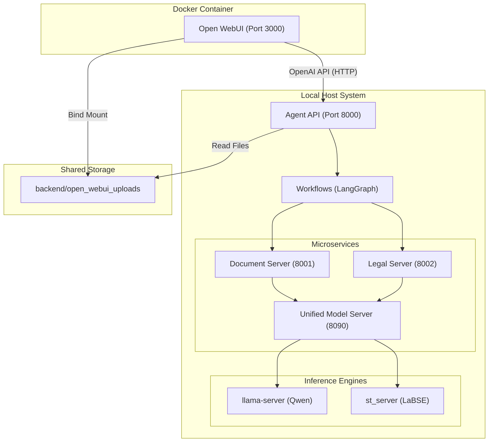

# Agent Navigator Pro

**Agent Navigator Pro** — это агентная система для анализа юридических документов и смет, построенная на микросервисной архитектуре. Проект использует локальные LLM (Qwen) и Embedding модели (LaBSE) для обеспечения приватности и безопасности данных.

В качестве пользовательского интерфейса используется **Open WebUI**, работающий в Docker, который взаимодействует с Python-бэкендом на хосте через OpenAI-compatible API.

## 🏗 Архитектура

Система разделена на два слоя: **Host Backend** (микросервисы) и **Docker Frontend** (Open WebUI).



### Ключевые Компоненты

| Компонент | Технология | Порт | Роль |
| :--- | :--- | :--- | :--- |
| **Open WebUI** | Docker | 3000 | Интерфейс чата, управление историей, загрузка файлов. |
| **Agent API** | FastAPI | 8000 | Точка входа, совместимая с OpenAI. Оркестратор агентов. |
| **Orchestrator** | LangGraph | - | Логика воркфлоу (`compare`, `equipment`). |
| **Document Server** | FastAPI | 8001 | Парсинг документов (PDF, DOCX) с поддержкой OCR. |
| **Legal Server** | FastAPI | 8002 | Юридический анализ, сравнение текстов (Batch Matching). |
| **UMS** | FastAPI | 8090 | Единый сервер управления моделями. |
| **ST Server** | FastAPI | 8093 | Сервер для SentenceTransformers (LaBSE). |

## 🚀 Быстрый Старт

### 1. Предварительные требования

*   **OS:** Linux (рекомендуется Ubuntu).
*   **GPU:** NVIDIA GPU с драйверами и CUDA 12+ (протестировано на RTX 2070 x2).
*   **Docker:** Установлен и настроен (с поддержкой `host-gateway`).
*   **Conda:** Anaconda или Miniconda.

### 2. Установка Бэкенда

1.  Создайте окружение Conda:
    ```bash
    conda create -n diploma_llm python=3.11
    conda activate diploma_llm
    ```

2.  Установите зависимости:
    ```bash
    cd backend
    pip install -r requirements.txt
    ```

3.  Скачайте модели (Qwen, LaBSE) в папку `backend/models` (структура описана в `backend/models/README.md` или `.env.example`).

4.  Настройте `.env`:
    ```bash
    cp .env.example .env
    # Убедитесь, что пути к моделям верны
    ```

### 3. Запуск Системы

Система запускается в два этапа: Бэкенд и Фронтенд.

#### Шаг А: Запуск Бэкенда (на Хосте)

Используйте скрипт `run_all.sh` (рекомендуется запускать в отдельном терминале):

```bash
cd backend
./run_all.sh
```
*Этот скрипт запустит `tmux` сессию с 5 окнами для всех микросервисов.*

#### Шаг Б: Запуск Open WebUI (в Docker)

Запустите контейнер с монтированием папки загрузок, чтобы агент видел файлы:

```bash
# Создаем папку для обмена файлами
mkdir -p backend/open_webui_uploads
chmod 777 backend/open_webui_uploads

# Запускаем контейнер
docker run -d -p 3000:8080 \
  --add-host=host.docker.internal:host-gateway \
  -v open-webui:/app/backend/data \
  -v $(pwd)/backend/open_webui_uploads:/app/backend/data/uploads \
  --name open-webui \
  --restart always \
  ghcr.io/open-webui/open-webui:main
```

### 4. Настройка Подключения

1.  Откройте браузер: `http://localhost:3000`.
2.  Создайте аккаунт администратора.
3.  Перейдите в **Settings -> Admin Settings -> Connections**.
4.  В разделе **OpenAI API**:
    *   **URL:** `http://172.17.0.1:8000/v1` (или IP вашего `docker0` интерфейса).
    *   **Key:** `sk-any-key` (любой текст).
5.  Нажмите "Сохранить" и проверьте соединение.
6.  В списке моделей должна появиться `agent-navigator`.

## 💡 Использование

1.  **Простой чат:** Выберите модель `agent-navigator` и общайтесь как с обычным ассистентом.
2.  **Сравнение документов:**
    *   Загрузите два файла (PDF, DOCX) через скрепку 📎.
    *   Напишите: *"Сравни эти документы"* или *"Проанализируй юридические риски"*.
    *   Агент автоматически найдет файлы в общей папке, запустит воркфлоу сравнения и выдаст подробный Markdown отчет.
    *   Отчет также сохранится в папке `backend/open_webui_uploads`.
3.  **Анализ сметы:**
    *   Загрузите ТЗ и Смету.
    *   Напишите: *"Проверь соответствие сметы техническому заданию"*.

## 🛠 Разработка и Отладка

*   **Логи:** Логи микросервисов доступны в `tmux` сессии (`tmux attach -t agent-navigator`) или в файлах `*.log` в папках сервисов.
*   **Перезапуск API:** Если вы меняете код оркестратора, нужно перезапустить только `agent_api.py`.
*   **Ошибки 500:** Чаще всего связаны с правами доступа к папке `backend/open_webui_uploads` или недоступностью UMS.

## Структура Проекта

```
.
├── backend/                           # Python Backend
│   ├── orchestrator/                  # Agent API и LangGraph Workflows
│   │   ├── agent_api.py               # Точка входа
│   │   └── workflows/                 # Логика агентов (compare.py, equipment.py)
│   ├── services/                      # Микросервисы
│   │   ├── document_server/           # Работа с файлами
│   │   ├── legal_server/              # Юридическая логика
│   │   └── model_manager/             # UMS и ST Server
│   ├── models/                        # Локальные модели (GGUF, ST)
│   ├── open_webui_uploads/            # Общая папка с Docker
│   └── run_all.sh                     # Скрипт запуска
├── for_cli/                           # Логи контекста и отчеты
├── docker-compose.yaml                # (Опционально)
└── README.md                          # Этот файл
```