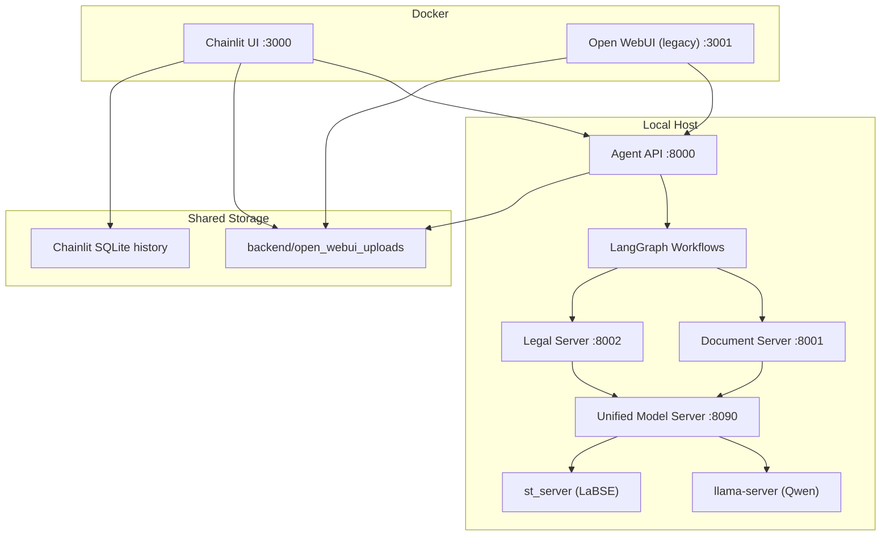

# Agent Navigator Pro

**Agent Navigator Pro** — агентная система для анализа документов, RAG-поиска, сравнения юридических актов и проверки соответствия ТЗ/КП. Основной пользовательский интерфейс проекта сейчас — **Chainlit** на порту `3000`. **Open WebUI** оставлен как legacy-вариант и запускается отдельным docker profile на порту `3001`.

Каноническая основная ветка репозитория: `v3.0`.

## Архитектура

Система разделена на два слоя:

- Docker UI: `chainlit-ui`
- Host backend: `agent_api`, `document_server`, `legal_server`, `unified_model_server`



## Основные компоненты

| Компонент | Технология | Порт | Роль |
| --- | --- | --- | --- |
| `chainlit-ui` | Docker + Chainlit | `3000` | Основной интерфейс чата, history, шаги workflow, загрузка файлов |
| `open-webui` | Docker + Open WebUI | `3001` | Legacy UI, запускается только через `--profile legacy` |
| `agent_api` | FastAPI | `8000` | OpenAI-compatible entrypoint, маршрутизация в workflow |
| `document_server` | FastAPI | `8001` | Парсинг PDF/DOCX, OCR, таблицы, чанки |
| `legal_server` | FastAPI | `8002` | Batch matching и сравнение юридических документов |
| `UMS` | FastAPI | `8090` | Управление моделями, `/infer`, `/v1/embeddings`, startup/fallback, optional remote `vLLM` adapter |
| `llama-server` / `vLLM` | llama.cpp / OpenAI-compatible upstream | dynamic | Генерация LLM-ответов |
| `st_server` | SentenceTransformers | `8093` | Embeddings для LaBSE |

## Что умеет система

- обычный чат с локальной LLM
- RAG-вопросы по загруженным документам
- `document_analysis` для одиночного документа
- `compare_documents` для двух юридических документов
- `equipment_analysis` для ТЗ, смет и коммерческих предложений
- сохранение markdown-отчётов в [`backend/open_webui_uploads`](backend/open_webui_uploads)

## Backend modes

`UMS` поддерживает несколько backend modes через `BACKEND_MODE`:

- `llama-cpp-python`
- `llama-server`
- `vllm`

`BACKEND_MODE=vllm` в текущем safe slice влияет только на heavy text inference path для `gguf`-LLM. Важно:

- `UMS` не поднимает `vLLM` сам, нужен отдельный внешний OpenAI-compatible `vLLM` endpoint;
- embeddings (`st`) и `gguf-vl` остаются на локальном runtime path;
- docker/compose profile для собственного `vLLM` deployment относится к отдельной фазе.

## Установка

### Способ 1 — одна команда (Ubuntu/Debian)

Клонировать репозиторий, установить все зависимости (Docker, Miniconda, Python env) и подготовить конфиг:

```bash
git clone <repo-url> agent-navigator-pro && cd agent-navigator-pro
bash scripts/setup_ubuntu.sh
```

Скрипт устанавливает: `tmux`, `docker`, `conda`, `python 3.11`, все pip-зависимости, создаёт `backend/.env` из шаблона и нужные директории.

Если репозиторий уже клонирован — запустить установку через launcher:

```bash
./scripts/launcher.sh --install
```

### Способ 2 — curl без клонирования

Если хочешь скачать и запустить установщик напрямую на сервер:

```bash
# Скачать только скрипт установки
curl -fsSL https://raw.githubusercontent.com/<org>/agent-navigator-pro/v3.0/scripts/setup_ubuntu.sh | bash
```

> **Примечание:** после выполнения `setup_ubuntu.sh` потребуется клонировать репозиторий вручную и указать пути к моделям в `backend/.env`.

### Способ 3 — ручная установка (любой дистрибутив)

```bash
# 1. Системные зависимости
sudo apt-get install -y tmux git curl wget docker.io docker-compose-plugin

# 2. Miniconda
wget -O miniconda.sh https://repo.anaconda.com/miniconda/Miniconda3-latest-Linux-x86_64.sh
bash miniconda.sh -b -p ~/miniconda3
source ~/miniconda3/etc/profile.d/conda.sh

# 3. Python env
conda create -n diploma_llm python=3.11 -y
conda activate diploma_llm
pip install -r backend/requirements.txt

# 4. Docker (если GPU)
distribution=$(. /etc/os-release; echo $ID$VERSION_ID)
curl -fsSL https://nvidia.github.io/libnvidia-container/gpgkey | sudo gpg --dearmor -o /usr/share/keyrings/nvidia-container-toolkit-keyring.gpg
curl -s -L https://nvidia.github.io/libnvidia-container/$distribution/libnvidia-container.list | \
  sed 's#deb https://#deb [signed-by=/usr/share/keyrings/nvidia-container-toolkit-keyring.gpg] https://#g' | \
  sudo tee /etc/apt/sources.list.d/nvidia-container-toolkit.list
sudo apt-get update && sudo apt-get install -y nvidia-container-toolkit
sudo nvidia-ctk runtime configure --runtime=docker && sudo systemctl restart docker
```

---

## Быстрый старт

### 1. Требования

| | Минимум (GPU) | CPU-only |
|---|---|---|
| GPU | NVIDIA ≥12 GB VRAM | — |
| RAM | ≥32 GB | ≥64 GB |
| Диск | ≥200 GB | ≥200 GB |
| Docker | 24+ с Compose v2 | то же |
| Python | 3.11 (conda) | то же |
| OS | Ubuntu 22.04+ / Debian 12+ | то же |

### 2. Настройка `.env`

```bash
cd backend
cp .env.example .env
```

Обязательно задать пути к моделям:

```bash
# Пути — абсолютные
MODEL_PATH_QWEN14B="/path/to/models/gguf/Qwen2.5-14B-Instruct-Q4_K_M.gguf"
MODEL_PATH_LABSE="/path/to/models/st/LaBSE"

# GPU: -1 = все слои на GPU, 0 = CPU only
N_GPU_LAYERS_QWEN14B=-1

# Сменить для production
CHAINLIT_ADMIN_PASSWORD="your-secure-password"
CHAINLIT_AUTH_SECRET="your-secret-key"
```

### 3. Сборка Docker-образа

```bash
docker compose build chainlit
```

### 4. Запуск системы

Канонический runtime entrypoint:

```bash
./scripts/launcher.sh --target native --profile adaptive
```

Container-oriented path:

```bash
./scripts/launcher.sh --target container --profile default
```

Launcher:

- запускает controlled bootstrap/preflight слой
- строит и применяет `backend/.env.runtime`
- запускает нужный target (`native` или `container`)
- печатает runtime summary через `UMS /status`

Совместимые wrapper scripts сохранены:

```bash
./scripts/run_native.sh
./scripts/run_all.sh
./scripts/run_container.sh
```

Они делегируют в `launcher.sh` и оставлены как compatibility aliases.

### 5. Отдельный запуск Chainlit

Если backend уже работает:

```bash
docker compose up -d chainlit
docker compose logs --tail=200 -f chainlit
```

UI будет доступен на:

- `http://localhost:3000`

Legacy Open WebUI при необходимости:

```bash
docker compose --profile legacy up -d open-webui
```

Он будет доступен на:

- `http://localhost:3001`

Monitoring stack:

```bash
docker compose --profile monitoring up -d prometheus grafana
# или
./scripts/run_monitoring.sh
```

Доступно:

- `http://localhost:9090` — Prometheus
- `http://localhost:3002` — Grafana

Remote `vLLM` runtime для `BACKEND_MODE=vllm`:

```bash
docker compose --profile vllm up -d vllm
docker compose logs --tail=200 -f vllm
```

При таком запуске `UMS` ожидает upstream на:

- `http://localhost:8101` по умолчанию (`VLLM_PORT` можно переопределить)

Важно:

- `vLLM` profile не поднимается по умолчанию;
- embeddings и `gguf-vl` остаются на локальном runtime path;
- для container path `run_all.sh` автоматически добавит `vllm` service, если `BACKEND_MODE=vllm`.

## Типовые сценарии

### RAG-вопрос по документу

1. Загрузи файл в Chainlit
2. Задай вопрос вроде:
   `Какой гарантийный срок указан в документе?`

### Анализ одного документа

Задай:

```text
Проанализируй этот документ и кратко опиши его содержание.
```

### Сравнение двух юридических документов

Загрузи 2 файла и задай:

```text
Сравни эти два юридических документа и выдели ключевые различия.
```

### Сравнение ТЗ и коммерческого предложения

Загрузи 2 файла и задай:

```text
Сравни ТЗ и коммерческое предложение, проверь соответствие оборудования.
```

## Benchmark — тест производительности

После запуска системы можно измерить скорость через все режимы работы:

```bash
# Все сценарии (health, embedding, chat, RAG, compare, equipment)
python scripts/benchmark.py

# Только чат и embedding (быстро, без файлов)
python scripts/benchmark.py --scenarios health,embedding,chat

# 3 повтора для усреднения + сохранить результат
python scripts/benchmark.py --repeats 3 --output results/gpu.json
```

Для сравнения **CPU vs GPU vs Hybrid**:

```bash
# 1. GPU-режим: задать N_GPU_LAYERS_QWEN14B=-1 в .env → перезапустить → запустить
python scripts/benchmark.py --output results/gpu.json

# 2. CPU-режим: задать N_GPU_LAYERS_QWEN14B=0 в .env → перезапустить → запустить
python scripts/benchmark.py --output results/cpu.json

# 3. Сравнить два прогона и сохранить сводный diff
python scripts/benchmark_compare.py results/cpu.json results/gpu.json --json-output results/compare.json
```

Скрипт автоматически фиксирует параметры `.env` и UMS runtime profile в JSON-результат.
`benchmark_compare.py` сравнивает latency/status/runtime metadata по shared/add/remove scenarios и даёт operator-friendly сводку.

## Полезные команды

Runtime preflight report:

```bash
./scripts/launcher.sh --target native --profile adaptive --report-only
```

Полный backend test suite без integration:

```bash
cd backend
pytest tests/ -v -m "not integration"
```

Health-check всех сервисов:

```bash
curl -s http://localhost:8000/health && echo " Agent API OK"
curl -s http://localhost:8001/health && echo " Doc Server OK"
curl -s http://localhost:8002/health && echo " Legal Server OK"
curl -s http://localhost:8090/health && echo " UMS OK"
```

Статус загруженных моделей:

```bash
curl -s http://localhost:8090/status | python3 -m json.tool
```

Scrapeable metrics:

```bash
curl -s http://localhost:8000/metrics | head
curl -s http://localhost:8090/metrics | head
```

Статус контейнеров:

```bash
docker compose ps
```

Логи Chainlit:

```bash
docker compose logs --tail=200 chainlit
```

Подключение к `tmux`:

```bash
tmux attach -t agent-navigator
```

## Текущее состояние UI и runtime

- основной UI: `Chainlit`
- direct chat сейчас работает в **non-stream** режиме как production-safe default
- `Open WebUI` сохранён как legacy path
- локализация `ru-RU`, `chainlit.md`, логотип и аватар теперь обслуживаются из repo-side ресурсов
- отчёты сохраняются в [`backend/open_webui_uploads`](backend/open_webui_uploads)

## Структура проекта

```text
.
├── backend/
│   ├── orchestrator/
│   │   ├── agent_api.py
│   │   ├── chainlit_app.py
│   │   ├── rag/
│   │   └── workflows/
│   ├── services/
│   │   ├── document_server/
│   │   ├── legal_server/
│   │   ├── model_manager/
│   │   └── hardware/
│   ├── tests/
│   ├── models/
│   └── open_webui_uploads/
├── docs/
├── scripts/
├── docker-compose.yaml
├── Dockerfile.chainlit
├── AGENTS.md
├── TASKS.md
└── README.md
```

## Руководства

| Документ | Что внутри |
|----------|-----------|
| [docs/guides/system-overview.md](docs/guides/system-overview.md) | Как работает система: архитектура, компоненты, поток данных, гибридный GPU/CPU режим |
| [docs/guides/tmux.md](docs/guides/tmux.md) | tmux: установка конфига, хоткеи (с учётом переназначений), работа с сессией проекта |
| [docs/guides/conda.md](docs/guides/conda.md) | Conda: установка, окружение `diploma_llm`, основные команды, зависимости проекта |
| [docs/deploy-guide.md](docs/deploy-guide.md) | Деплой на сервер: требования, перенос, сборка Docker, запуск, чеклист |

## Где смотреть дальше

- backlog и техдолг: [`TASKS.md`](TASKS.md)
- правила работы по репозиторию: [`AGENTS.md`](AGENTS.md)
- модели: [`backend/models/README.md`](backend/models/README.md)
