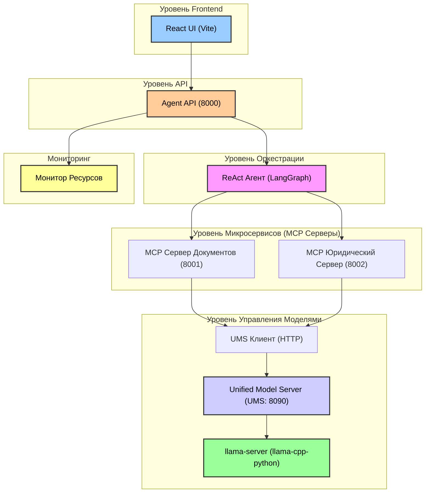

# Agent Navigator Pro

Agent Navigator Pro — это прототип, демонстрирующий микросервисную архитектуру для агентной системы анализа документов. Он реализует концепцию **Unified Model Server (UMS)** для эффективного управления ресурсами на одной машине.

В проекте используются **LangGraph** для оркестрации, **FastAPI** для создания независимых микросервисов (MCP-серверов) и **llama-cpp-python** для инференса локальных моделей.

## Архитектура

Система разделена на несколько уровней, от пользовательского интерфейса (frontend) до бэкенда управления моделями.



### Ключевые Компоненты

| Компонент | Путь | Порт | Роль |
| :--- | :--- | :--- | :--- |
| **React UI** | `frontend/src/` | - | Пользовательский интерфейс (чат, настройки, мониторинг) |
| **Agent API** | `backend/orchestrator/agent_api.py` | 8000 | FastAPI обёртка с SSE стримингом шагов ReAct |
| **ReAct Агент** | `backend/orchestrator/react_agent_http.py` | - | Главный оркестратор (LangGraph) |
| **Сервер Документов** | `backend/services/document_server/mcp_document_server.py` | 8001 | Сервис для работы с документами (загрузка, чанкинг, OCR) |
| **Юридический Сервер** | `backend/services/legal_server/mcp_legal_server.py` | 8002 | Сервис для юридического анализа (сравнение, анализ изменений) |
| **Монитор Ресурсов** | `backend/services/resource_monitor.py` | - | Мониторинг VRAM, RAM, CPU и CUDA |
| **UMS Клиент** | `backend/services/model_manager/ums_client.py` | - | HTTP-клиент для UMS |
| **UMS** | `backend/services/model_manager/unified_model_server.py` | 8090 | Управляет загрузкой/выгрузкой моделей для оптимизации VRAM |

## Особенности

- **Стриминг Агента в Реальном Времени**: SSE стриминг отображает шаги ReAct (Thought → Action → Observation) в UI.
- **Мониторинг Ресурсов**: Отслеживает использование VRAM, RAM и CPU через `psutil` и `pynvml`.
- **Динамическое Управление Моделями (UMS)**: Загружает и выгружает модели по требованию для экономии VRAM.
- **Гибкие Режимы Работы**: Поддерживает режимы GPU, CPU и Hybrid (`--n_gpu_layers`) для адаптации к различному оборудованию.

## Требования

- Python 3.11+
- Node.js 18+
- NVIDIA GPU с CUDA (рекомендуется: RTX 3060 12GB или выше)

## Установка

Для подробной инструкции по установке, пожалуйста, обратитесь к [INSTALLATION.md](INSTALLATION.md).

**Быстрый старт:**

```bash
# Backend
cd backend
python3.11 -m venv venv
source venv/bin/activate
pip install -r requirements.txt

# Frontend
cd ../frontend
npm install
```

## Запуск Приложения

### 1. Запуск Сервисов Бэкенда

Вы можете запустить все сервисы вручную в отдельных терминалах или использовать предоставленный скрипт.

**Ручной Запуск:**

```bash
# Терминал 1: Agent API (Главный Сервер)
cd backend/orchestrator
uvicorn agent_api:app --host 0.0.0.0 --port 8000

# Терминал 2: Сервер Документов
cd backend/services/document_server
uvicorn mcp_document_server:app --host 0.0.0.0 --port 8001

# Терминал 3: Юридический Сервер
cd backend/services/legal_server
uvicorn mcp_legal_server:app --host 0.0.0.0 --port 8002

# Терминал 4: Unified Model Server (UMS)
cd backend/services/model_manager
python unified_model_server.py
```

**Автоматический Запуск (через tmux):**

```bash
cd backend
./run_all.sh
```

### 2. Запуск Frontend

```bash
# Из директории frontend
cd frontend
npm run dev
```

## Тестирование

Для проверки отсутствия галлюцинаций и корректности работы очистки ответов используйте встроенный тест:

```bash
# Запуск через python
python3 backend/tests/test_agent_hallucinations.py

# Или через pytest (если установлен)
pytest backend/tests/test_agent_hallucinations.py
```

## API Эндпоинты

Основной **Agent API** доступен по адресу `http://localhost:8000`.

| Метод | Эндпоинт | Описание |
| :--- | :--- | :--- |
| GET | `/health` | Проверка статуса всех подключенных сервисов. |
| GET | `/status` | Получение информации о ресурсах (VRAM, RAM, CPU, CUDA). |
| POST | `/agent/chat` | Отправка запроса агенту. |
| GET | `/agent/stream/{session_id}` | Стриминг шагов агента ReAct через SSE. |

### Пример Использования

```bash
# Проверка здоровья сервисов
curl http://localhost:8000/health

# Отправка запроса агенту
curl -X POST http://localhost:8000/agent/chat \
  -H "Content-Type: application/json" \
  -d '{"query": "Загрузи документ /tmp/test.pdf"}'
```

## Конфигурация Моделей

Модели конфигурируются через переменные окружения. Разместите файлы моделей в директории `backend/models` и установите пути.

```bash
export MODEL_PATH_QWEN14B="./models/Qwen2.5-14B-Instruct-Q4_K_M.gguf"
export MODEL_PATH_QWENVL="./models/Qwen3-VL-8B-Instruct-Q4_K_M.gguf"
export MODEL_PATH_LABSE="./models/LaBSE-Q4_K_M.gguf"
export MMPROJ_PATH="./models/mmproj-Qwen3-VL-8B-Instruct-F16.gguf"
```

## Структура Проекта

```
.
├── README.md                          # Основная документация проекта
├── INSTALLATION.md                    # Подробное руководство по установке
├── frontend/                          # Код React Frontend
│   ├── src/                           # Исходный код
│   ├── package.json                   # Зависимости Node.js
│   └── ...
└── backend/                           # Код Python Backend
    ├── orchestrator/                  # Agent API и оркестратор LangGraph
    ├── services/                      # Микросервисы (Document, Legal, UMS)
    ├── models/                        # Директория для GGUF моделей (игнорируется git)
    ├── requirements.txt               # Зависимости Python
    ├── run_all.sh                     # Скрипт для запуска всех сервисов
    └── tests/                         # Тесты (включая тесты на галлюцинации)
```
