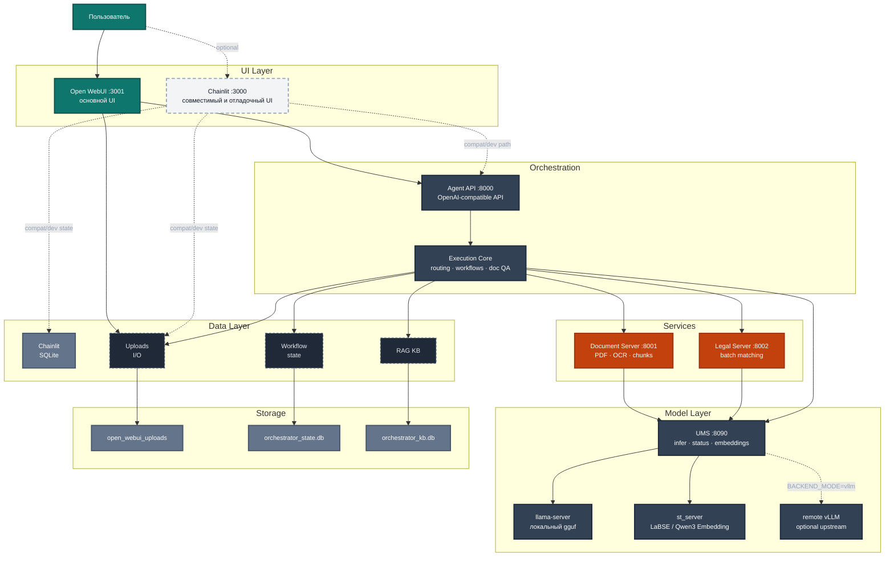

# llm-tools-platform

**llm-tools-platform** — агентная система для анализа документов, RAG-поиска, сравнения юридических актов и проверки соответствия ТЗ/КП. Основной пользовательский интерфейс проекта сейчас — **Open WebUI** на порту `3001`. **Chainlit** сохранён как совместимый и отладочный UI на порту `3000`.

Каноническая основная ветка репозитория: `v3.0`.

## Архитектура

Система разделена на два слоя:

- Docker UI: `open-webui` + `chainlit-ui`
- Host backend: `agent_api`, `document_server`, `legal_server`, `unified_model_server`



## Основные компоненты

| Компонент | Технология | Порт | Роль |
| --- | --- | --- | --- |
| `open-webui` | Docker + Open WebUI | `3001` | Основной пользовательский shell, входит в основной compose-стек |
| `chainlit-ui` | Docker + Chainlit | `3000` | Совместимый и отладочный интерфейс чата, history, шаги workflow, загрузка файлов |
| `agent_api` | FastAPI | `8000` | OpenAI-compatible entrypoint, маршрутизация в workflow |
| `document_server` | FastAPI | `8001` | Парсинг PDF/DOCX, OCR, таблицы, чанки |
| `legal_server` | FastAPI | `8002` | Batch matching и сравнение юридических документов |
| `UMS` | FastAPI | `8090` | Управление моделями, `/infer`, `/v1/embeddings`, startup/fallback, optional remote `vLLM` adapter |
| `llama-server` / `vLLM` | llama.cpp / OpenAI-compatible upstream | dynamic | Генерация LLM-ответов |
| `st_server` | SentenceTransformers | `8093` | Embeddings для LaBSE |

## Что умеет система

- обычный чат с локальной LLM
- RAG-вопросы по загруженным документам
- `document_analysis` для одиночного документа
- `compare_documents` для двух юридических документов
- `equipment_analysis` для ТЗ, смет и коммерческих предложений
- сохранение markdown-отчётов в [`backend/open_webui_uploads`](backend/open_webui_uploads)

## Backend modes

`UMS` поддерживает несколько backend modes через `BACKEND_MODE`:

- `llama-cpp-python`
- `llama-server`
- `vllm`

`BACKEND_MODE=vllm` в текущем safe slice влияет только на heavy text inference path для `gguf`-LLM. Важно:

- `UMS` не поднимает `vLLM` сам, нужен отдельный внешний OpenAI-compatible `vLLM` endpoint;
- embeddings (`st`) и `gguf-vl` остаются на локальном runtime path;
- docker/compose profile для собственного `vLLM` deployment относится к отдельной фазе.
- для локального `llama-server` prompt-cache policy управляется через `UMS_LLAMA_CACHE_PROMPT=true|false` и публикуется в `UMS /status -> prompt_cache_policy`.

## Установка

### Способ 1 — одна команда через launcher/install coordinator

Клонировать репозиторий, установить все зависимости (Docker, Miniconda, Python env) и подготовить конфиг:

```bash
git clone <repo-url> llm-tools-platform && cd llm-tools-platform
./scripts/launcher.sh --install --platform ubuntu
```

Для Ubuntu Server:

```bash
./scripts/launcher.sh --install --platform ubuntu-server
```

Для WSL внутри Ubuntu-дистрибутива:

```bash
./scripts/launcher.sh --install --platform wsl
```

Для Windows host:

```powershell
powershell -ExecutionPolicy Bypass -File scripts/install/install_windows.ps1 -CheckOnly
```

Unified install path использует platform-specific wrappers и для Linux по-прежнему переиспользует heavy bootstrap через `scripts/setup_ubuntu.sh`.

Если репозиторий уже клонирован — запустить установку через launcher:

```bash
./scripts/launcher.sh --install --platform ubuntu
```

Этот путь теперь сводится к одному installer coordinator:

```bash
./scripts/install/install.sh
```

Сейчас он выбирает platform wrapper (`ubuntu`, `ubuntu-server`, `wsl`, `windows`). Для Linux heavy install всё ещё делегируется в `scripts/setup_ubuntu.sh`; модульные installer-step scripts в основном остаются scaffold-only, а `scripts/models/install_models.sh` уже отвечает за model provisioning.

Поддерживаемые platform-specific install paths:

```bash
# Ubuntu / Ubuntu Server / WSL
./scripts/install/install.sh --platform auto
./scripts/install/install.sh --platform ubuntu
./scripts/install/install.sh --platform ubuntu-server
./scripts/install/install.sh --platform wsl
```

```powershell
# Windows host bootstrap for WSL-based development path
powershell -ExecutionPolicy Bypass -File scripts/install/install_windows.ps1 -CheckOnly
```

Windows host path подготавливает WSL/Docker Desktop, а сам рабочий dev runtime для проекта остаётся Linux/WSL-first.

### Способ 2 — curl без клонирования

Если хочешь скачать и запустить установщик напрямую на сервер:

```bash
# Скачать только скрипт установки
curl -fsSL https://raw.githubusercontent.com/<org>/llm-tools-platform/v3.0/scripts/setup_ubuntu.sh | bash
```

> **Примечание:** после выполнения `setup_ubuntu.sh` потребуется клонировать репозиторий вручную и указать пути к моделям в `backend/.env`.

### Способ 3 — ручная установка (любой дистрибутив)

```bash
# 1. Системные зависимости
sudo apt-get install -y tmux git curl wget docker.io docker-compose-plugin \
  libcairo2 libpango-1.0-0 libpangocairo-1.0-0 libgdk-pixbuf-2.0-0 shared-mime-info

# 2. Miniconda
wget -O miniconda.sh https://repo.anaconda.com/miniconda/Miniconda3-latest-Linux-x86_64.sh
bash miniconda.sh -b -p ~/miniconda3
source ~/miniconda3/etc/profile.d/conda.sh

# 3. Python env
conda activate base
pip install -r backend/requirements.txt

# Важно: requirements включают SQL/persistence-зависимости
# (SQLAlchemy, aiosqlite, asyncpg). Без них Chainlit history/state
# и backend persistence могут падать с неочевидными ошибками.
# Для красивого markdown->PDF рендера отчётов также нужны Markdown + WeasyPrint
# и системные библиотеки cairo/pango/gdk-pixbuf.

# 4. Docker (если GPU)
distribution=$(. /etc/os-release; echo $ID$VERSION_ID)
curl -fsSL https://nvidia.github.io/libnvidia-container/gpgkey | sudo gpg --dearmor -o /usr/share/keyrings/nvidia-container-toolkit-keyring.gpg
curl -s -L https://nvidia.github.io/libnvidia-container/$distribution/libnvidia-container.list | \
  sed 's#deb https://#deb [signed-by=/usr/share/keyrings/nvidia-container-toolkit-keyring.gpg] https://#g' | \
  sudo tee /etc/apt/sources.list.d/nvidia-container-toolkit.list
sudo apt-get update && sudo apt-get install -y nvidia-container-toolkit
sudo nvidia-ctk runtime configure --runtime=docker && sudo systemctl restart docker
```

---

## Быстрый старт

### 1. Требования

| | Минимум (GPU) | CPU-only |
|---|---|---|
| GPU | NVIDIA ≥12 GB VRAM | — |
| RAM | ≥32 GB | ≥64 GB |
| Диск | ≥200 GB | ≥200 GB |
| Docker | 24+ с Compose v2 | то же |
| Python | 3.11 (conda) | то же |
| OS | Ubuntu 22.04+ / Debian 12+ | то же |

### 2. Настройка `.env`

```bash
cd backend
cp .env.example .env
cd ..
./scripts/bootstrap_env.sh --check --target=native
```

`bootstrap_env.sh` теперь делает базовую self-heal подготовку для `backend/.env`:
- если `backend/.env` отсутствует, создаёт его из `backend/.env.example`;
- если `CHAINLIT_AUTH_SECRET` пустой или оставлен дефолтным, автоматически генерирует новое значение и записывает его в `backend/.env`.

Канонический справочник по флагам, env-файлам и runtime override-contract находится в [docs/flags-reference.md](docs/flags-reference.md).

Обязательно задать канонический registry и пути к model artifacts:

```bash
# Канонический source of truth для model/role bindings
MODEL_REGISTRY_CONFIG_PATH="/path/to/repo/backend/config/models.yaml"

# Пути к артефактам моделей
MODEL_PATH_LLM="/path/to/models/gguf/Qwen2.5-14B-Instruct-Q4_K_M.gguf"
MODEL_PATH_VLM="/path/to/models/gguf/Qwen3-VL-8B-Instruct-Q4_K_M.gguf"
MODEL_PATH_EMBEDDING_INTENT="/path/to/models/st/Qwen3-Embedding-0.6B"
MODEL_PATH_EMBEDDING_RETRIEVAL="/path/to/models/st/LaBSE"

# GPU: -1 = все слои на GPU, 0 = CPU only
N_GPU_LAYERS_QWEN14B=-1

# Bootstrap сам сгенерирует CHAINLIT_AUTH_SECRET, если он пустой/дефолтный.
# Для production всё равно проверьте и смените пароли ниже.
CHAINLIT_ADMIN_PASSWORD="your-secure-password"
CHAINLIT_AUTH_SECRET="your-secret-key"
```

`backend/config/models.yaml` теперь хранит registry моделей, role bindings (`primary` / `fallback`), tier policy и preload sequence для `UMS`.

Universal failover теперь тоже опирается на этот registry:
- client/runtime path сначала использует `primary` модель роли;
- при `load` / `probe` / `infer` model-failure делает ровно один retry на `fallback`;
- `429 busy` и user-cancel не считаются поводом для model failover;
- structured metadata сохраняется в `model_execution`, а `UMS /status` публикует `last_fallback_event`.

Для `WSL` и случаев, когда на системном диске не хватает места, модели можно хранить на другом диске и указывать абсолютные пути, например `/mnt/d/agent-models/...`:

```bash
MODEL_REGISTRY_CONFIG_PATH="/mnt/d/llm-tools-platform/backend/config/models.yaml"
MODEL_PATH_LLM="/mnt/d/agent-models/gguf/qwen-14b/Qwen2.5-14B-Instruct-Q4_K_M.gguf"
MODEL_PATH_VLM="/mnt/d/agent-models/gguf/Qwen3-VL-8B-Q4/Qwen3-VL-8B-Instruct-Q4_K_M.gguf"
MMPROJ_PATH="/mnt/d/agent-models/gguf/Qwen3-VL-8B-Q4/mmproj-Qwen3-VL-8B-Instruct-F16.gguf"
MODEL_PATH_EMBEDDING_INTENT="/mnt/d/agent-models/st/Qwen3-Embedding-0.6B"
MODEL_PATH_EMBEDDING_RETRIEVAL="/mnt/d/agent-models/st/LaBSE"
```

Windows-ярлыки не нужны: для `WSL` достаточно обычных путей `/mnt/d/...`.

Legacy aliases для путей сохранены только для compatibility rollout:
`MODEL_PATH_QWEN14B` -> `MODEL_PATH_LLM`,
`MODEL_PATH_QWENVL` -> `MODEL_PATH_VLM`,
`MODEL_PATH_QWEN3_EMBEDDING_06B` -> `MODEL_PATH_EMBEDDING_INTENT`,
`MODEL_PATH_LABSE` -> `MODEL_PATH_EMBEDDING_RETRIEVAL`.

Выбор primary/fallback модели через env больше не считается каноническим путём. Для новых конфигураций binding ролей задаётся в `models.yaml`, а env используется только как override layer и path/secrets contract.

Для local/dev launcher допускает override:

```bash
LLM_TOOLS_PLATFORM_ALLOW_INSECURE_DEFAULTS=1
```

Но в production bootstrap считает дефолтные `CHAINLIT_ADMIN_PASSWORD` и `GF_SECURITY_ADMIN_PASSWORD` недопустимыми, а `CHAINLIT_AUTH_SECRET` при пустом/дефолтном значении ротирует автоматически в `backend/.env`.

### 3. Сборка Docker-образа

```bash
docker compose build chainlit
```

### 4. Запуск системы

Канонический runtime entrypoint:

```bash
./scripts/launcher.sh --target native --profile adaptive
./scripts/launcher.sh --install
./scripts/launcher.sh --target native --models-root /mnt/d/agent-models
```

Container-oriented path:

```bash
./scripts/launcher.sh --target container --profile default
```

Launcher:

- запускает controlled bootstrap/preflight слой
- перед запуском делает `ensure-present` для обязательных моделей через `scripts/models/install_models.sh`
- для `native` path использует `backend/.env` как единственный постоянный конфиг
- для `container` path при необходимости строит `backend/.env.runtime`
- запускает нужный target (`native` или `container`)
- печатает runtime summary через `UMS /status`

По умолчанию launcher проверяет `core` набор:
- `MODEL_PATH_LLM`
- `MODEL_PATH_EMBEDDING_INTENT`
- `MODEL_PATH_EMBEDDING_RETRIEVAL`

Полный набор с VLM:

```bash
./scripts/launcher.sh --target native --asset-set all
```

Если фазу downloader нужно временно пропустить:

```bash
./scripts/launcher.sh --target native --skip-model-download
```

Отдельный model provisioning path:

```bash
./scripts/models/install_models.sh --dry-run
./scripts/models/install_models.sh --ensure-present --models-root=/mnt/d/agent-models
HF_HOME=/mnt/d/hf-cache ./scripts/models/install_models.sh --ensure-present --asset-set=all
```

`--models-root` в `launcher.sh` и `install_models.sh` строит канонический layout внутри указанного root. Для постоянной конфигурации native/runtime path лучше фиксировать абсолютные пути прямо в `backend/.env`.

Для native-пути рекомендации по железу теперь вынесены отдельно:

```bash
./scripts/evaluate_runtime.sh recommend
./scripts/evaluate_runtime.sh plan --profile adaptive
./scripts/evaluate_runtime.sh detect
```

Этот сценарий:

- читает только `backend/.env`
- показывает placement plan и рекомендуемые значения
- не пишет `backend/.env.runtime`
- не меняет `backend/.env` автоматически

Для native runtime важный контракт такой:

- `backend/.env` — единственный user-owned конфиг
- `backend/.env.runtime` не нужен для обычного `run_native.sh`
- `backend/.env.native` и `backend/.env.hardware.override` считаются deprecated и больше не являются canonical source of truth

Если нужно жёстко разделить нагрузку между GPU, задавайте это в `backend/.env` через:

```bash
LLM_DEVICE_MODE=gpu
VLM_DEVICE_MODE=gpu
INTENT_EMBEDDER_DEVICE_MODE=cpu
RETRIEVAL_EMBEDDER_DEVICE_MODE=cpu
UMS_LLM_GPU_INDICES=0,1
UMS_EMBEDDING_GPU_INDEX=1
UMS_LLM_MIN_FREE_VRAM_GB=0
UMS_LLM_MIN_BALANCE_RATIO=0.5
```

`GPU_LAYERS_MODE` и `N_GPU_LAYERS_OVERRIDE` остаются частью preflight/evaluator surface, но реальный per-model offload по `gguf`-моделям по-прежнему задаётся через `N_GPU_LAYERS_QWEN14B`, `N_GPU_LAYERS_QWENVL` и связанные `N_GPU_LAYERS_*`.

Для container path generated `backend/.env.runtime` всё ещё используется как applied current-run файл.

Полный справочник флагов и `env`-контракта находится в [docs/flags-reference.md](docs/flags-reference.md).

Если проект обновлялся поверх старого окружения или раньше ставился неполный набор пакетов, безопасно повторно выполнить:

```bash
cd backend && pip install -r requirements.txt
```

Это особенно важно для SQL/persistence-зависимостей:
- `SQLAlchemy`
- `aiosqlite`
- `asyncpg`

Если `conda` ругается на `ToSNonInteractiveError`, это не runtime-баг проекта, а непринятые Terms of Service для каналов Anaconda. Официальный способ:

```bash
conda tos accept
```

или точечно:

```bash
conda tos accept --override-channels --channel https://repo.anaconda.com/pkgs/main
```

Используемые Hugging Face источники:
- `Qwen/Qwen2.5-14B-Instruct-GGUF`
- `Qwen/Qwen3-VL-8B-Instruct-GGUF`
- `Qwen/Qwen3-Embedding-0.6B`
- `sentence-transformers/LaBSE`

Полная карта runtime-скриптов, их роли и ограничения описана в [docs/scripts/README.md](docs/scripts/README.md).
Полный справочник флагов, env-файлов, timeout/concurrency knobs и рекомендаций по placement находится в [docs/flags-reference.md](docs/flags-reference.md).

## TIERS 1|2|3|4

Tier выбирается автоматически по железу через `TierSelector`; для ручной фиксации можно использовать `TIER_OVERRIDE=1|2|3|4`.
Это не marketing label, а честное описание того, какой retrieval/runtime path система реально может поддержать на текущем железе.

| Tier | Типичный профиль | Что включается | Что можно делать | Что нельзя ожидать |
| --- | --- | --- | --- | --- |
| `Tier 1` | CPU-only, базовый RAM profile | `basic retrieval`, `Qwen 7B Q4`, `ctx=4096`, embeddings на `cpu`, `BM25`, без reranker | обычный чат, простые RAG-вопросы по загруженным документам, базовый `document_analysis`, небольшие сравнения документов, сохранение отчётов | нет `corrective retrieval`, нет reranker, нет iterative loop, нет multi-agent path; хуже работает на длинных/шумных документах и больших батчах |
| `Tier 2` | RAM-heavy CPU или слабый GPU, mixed CPU/GPU path | `corrective retrieval`, `Qwen 14B Q4`, `ctx=8192`, `BM25`, embeddings на `cpu` или `cuda` по бюджету VRAM | более стабильный document QA, `compare_documents`, `equipment_analysis`, работа с более длинным контекстом, лучшее восстановление после слабого первого retrieval | нет reranker, нет `iterative retrieval`, нет `planned multi-agent`; параллелизм LLM остаётся ограниченным |
| `Tier 3` | Single-GPU runtime, начиная примерно с `12 GB` usable VRAM; лучший path от `24 GB+` | `iterative retrieval`, reranker, `ctx=16384`, `Qwen 14B/32B`, embeddings на `cuda`, `BM25` | сложные RAG-вопросы, более качественная работа с неоднозначными запросами, длинный контекст, тяжёлый `equipment_analysis`, более уверенный retrieval на больших документах | это не полноценный autonomous multi-agent runtime; нет обещания общего planner/tool swarm, `max_concurrent_llm` по-прежнему консервативен |
| `Tier 4` | Multi-GPU или high-end VRAM profile | `planned multi-agent`, `Qwen 72B Q4`, `ctx=32768`, reranker, `BGE-M3`, embeddings на `cuda`, повышенный concurrency | максимальный throughput, самые большие batch/scenario для сравнения и document QA, лучший запас по контексту и retrieval quality, более агрессивный high-end runtime | label `planned multi-agent` не означает, что в текущем public runtime уже доступен полноценный general-purpose multi-agent orchestration; это подготовленный high-end path, а не обещание полного agent swarm |

Коротко по фичам:

- На всех tiers доступны чат, RAG по загруженным документам, `document_analysis`, `compare_documents`, `equipment_analysis`, `BM25` и сохранение markdown-отчётов.
- Начиная с `Tier 2`, система лучше выдерживает длинные документы и ошибки первого retrieval pass.
- Начиная с `Tier 3`, включаются reranker и iterative retrieval, что заметно важнее для сложного document QA, чем просто рост размера модели.
- `Tier 4` сейчас нужно читать как high-end runtime preparation layer. До появления отдельного planner/tool-use runtime не стоит продавать его как уже реализованный полноценный multi-agent режим.

Совместимые wrapper scripts сохранены:

```bash
./scripts/run_native.sh
./scripts/run_all.sh
./scripts/run_container.sh
```

Они делегируют в `launcher.sh` и оставлены как compatibility aliases, а не как конкурирующие canonical entrypoints.

Для container path важно разделять `build` и `run`:

- `./scripts/run_all.sh` и `./scripts/launcher.sh --target container --profile default` только запускают уже собранные образы через `docker compose up --no-build`;
- backend образы (`agent-api`, `document-server`, `legal-server`, `ums`) нужно собирать отдельно явной командой `docker compose build agent-api document-server legal-server ums`;
- для Chainlit rebuild остаётся отдельным шагом: `docker compose build chainlit`.

Для install-path launcher тоже остаётся user-facing entrypoint. Внутренний coordinator находится в `./scripts/install/install.sh`: сейчас он делегирует `native` установку в `scripts/setup_ubuntu.sh`, а для `container` target выводит guidance без host-install действий.

Platform-specific install paths:

```bash
# Ubuntu / Ubuntu Server / WSL
./scripts/install/install.sh --platform auto
./scripts/install/install.sh --platform ubuntu
./scripts/install/install.sh --platform ubuntu-server
./scripts/install/install.sh --platform wsl
```

```powershell
# Windows host bootstrap for WSL-based development path
powershell -ExecutionPolicy Bypass -File scripts/install/install_windows.ps1
```

Windows host path подготавливает WSL/Docker Desktop, а сам рабочий dev runtime для проекта остаётся Linux/WSL-first.

Для `WSL` installer ведёт себя guided-образом:
- сначала печатает ожидания по Docker Desktop / WSL integration;
- если `docker` внутри `WSL` не виден или daemon недоступен, не пытается молча ставить Docker Engine в дистрибутив;
- вместо этого выводит явную причину и спрашивает, пропустить ли Docker step или остановиться.
- repo-managed `tmux` конфиги тоже ставятся аккуратно: если файл уже совпадает с шаблоном, он не трогается; если отличается, installer спрашивает перед overwrite.

### 5. Отдельный запуск UI

Основной пользовательский shell:

```bash
docker compose up -d open-webui
```

Он будет доступен на:

- `http://localhost:3001`

Эта команда также подтянет `qdrant` как зависимость `Open WebUI`.

Совместимый `Chainlit`-контур при необходимости:

```bash
docker compose up -d chainlit
docker compose logs --tail=200 -f chainlit
```

UI будет доступен на:

- `http://localhost:3000`

Monitoring stack:

```bash
docker compose --profile monitoring up -d prometheus grafana
# или
./scripts/run_monitoring.sh
```

Доступно:

- `http://localhost:9090` — Prometheus
- `http://localhost:3002` — Grafana

Для monitoring profile задай отдельные Grafana credentials:

- `GF_SECURITY_ADMIN_USER`
- `GF_SECURITY_ADMIN_PASSWORD`

Remote `vLLM` runtime для `BACKEND_MODE=vllm`:

```bash
docker compose --profile vllm up -d vllm
docker compose logs --tail=200 -f vllm
```

При таком запуске `UMS` ожидает upstream на:

- `http://localhost:8101` по умолчанию (`VLLM_PORT` можно переопределить)

Важно:

- `vLLM` profile не поднимается по умолчанию;
- embeddings и `gguf-vl` остаются на локальном runtime path;
- для container path `run_all.sh` автоматически добавит `vllm` service, если `BACKEND_MODE=vllm`.

### 5.1. Прототип operator UI

Отдельный web-прототип operator UI живёт в `prototype/operator-ui`.

Быстрый статический preview:

```bash
npm run prototype:operator-ui
```

- `http://127.0.0.1:4173`

Интегрированный backend-served запуск:

```bash
cd backend
uvicorn orchestrator.agent_api:app --reload --port 8000
```

- `http://127.0.0.1:8000/operator-ui/`

Детали и contract endpoints описаны в:

- `prototype/operator-ui/README.md`

## Типовые сценарии

### RAG-вопрос по документу

1. Загрузи файл в Chainlit
2. Задай вопрос вроде:
   `Какой гарантийный срок указан в документе?`

### Анализ одного документа

Задай:

```text
Проанализируй этот документ и кратко опиши его содержание.
```

### Сравнение двух юридических документов

Загрузи 2 файла и задай:

```text
Сравни эти два юридических документа и выдели ключевые различия.
```

### Сравнение ТЗ и коммерческого предложения

Загрузи 2 файла и задай:

```text
Сравни ТЗ и коммерческое предложение, проверь соответствие оборудования.
```

## Benchmark — тест производительности

После запуска системы можно измерить скорость через все режимы работы:

```bash
# Все сценарии (health, embedding, chat, RAG, compare, equipment)
python scripts/benchmark.py

# Только чат и embedding (быстро, без файлов)
python scripts/benchmark.py --scenarios health,embedding,chat

# 3 повтора для усреднения + сохранить результат
python scripts/benchmark.py --repeats 3 --output results/gpu.json
```

Для сравнения **CPU vs GPU vs Hybrid**:

```bash
# 1. GPU-режим: задать N_GPU_LAYERS_QWEN14B=-1 в .env → перезапустить → запустить
python scripts/benchmark.py --output results/gpu.json

# 2. CPU-режим: задать N_GPU_LAYERS_QWEN14B=0 в .env → перезапустить → запустить
python scripts/benchmark.py --output results/cpu.json

# 3. Сравнить два прогона и сохранить сводный diff
python scripts/benchmark_compare.py results/cpu.json results/gpu.json --json-output results/compare.json
```

Скрипт автоматически фиксирует параметры `.env` и UMS runtime profile в JSON-результат.
`benchmark_compare.py` сравнивает latency/status/runtime metadata по shared/add/remove scenarios и даёт operator-friendly сводку.

Для сравнения **`llama-server` vs `vLLM` migration path**:

```bash
# 1. Baseline: локальный heavy runtime
BACKEND_MODE=llama-server ./scripts/run_all.sh --no-attach
python scripts/benchmark.py --output results/llama-server.json

# 2. Candidate: remote vLLM runtime
docker compose --profile vllm up -d vllm
BACKEND_MODE=vllm python scripts/benchmark.py --output results/vllm.json

# 3. Compare
python scripts/benchmark_compare.py \
  results/llama-server.json \
  results/vllm.json \
  --baseline-label llama-server \
  --candidate-label vllm \
  --json-output results/vllm-migration-compare.json
```

Для отдельной проверки **prompt-cache warm repeat** на локальном `llama-server` используй direct UMS probe:

```bash
BACKEND_MODE=llama-server python scripts/benchmark.py --scenarios prompt_cache_probe --output results/prompt-cache.json
```

В результате появятся `cold_elapsed_sec`, `warm_elapsed_sec`, `speedup`, `delta_pct` и snapshot `prompt_cache_policy` из `UMS /status`.

В benchmark JSON теперь отдельно фиксируются:
- `backend_mode`
- `runtime_metadata`
- `runtime_profile`
- `active_heavy_model`
- `running_models`

## Полезные команды

Runtime preflight report:

```bash
./scripts/launcher.sh --target native --profile adaptive --report-only
```

Полный backend test suite без integration:

```bash
cd backend
pytest tests/ -v -m "not integration"
```

Health-check всех сервисов:

```bash
curl -s http://localhost:8000/health && echo " Agent API OK"
curl -s http://localhost:8001/health && echo " Doc Server OK"
curl -s http://localhost:8002/health && echo " Legal Server OK"
curl -s http://localhost:8090/health && echo " UMS OK"
```

Статус загруженных моделей:

```bash
curl -s http://localhost:8090/status | python3 -m json.tool
```

Scrapeable metrics:

```bash
curl -s http://localhost:8000/metrics | head
curl -s http://localhost:8090/metrics | head
```

Статус контейнеров:

```bash
docker compose ps
```

Логи Chainlit:

```bash
docker compose logs --tail=200 chainlit
```

Подключение к `tmux`:

```bash
tmux attach -t llm-tools-platform
```

## Текущее состояние UI и runtime

- основной UI: `Open WebUI`
- direct chat сейчас работает в **non-stream** режиме как production-safe default
- `Chainlit` сохранён как совместимый и отладочный путь
- локализация `ru-RU`, `chainlit.md`, логотип и аватар теперь обслуживаются из repo-side ресурсов
- отчёты сохраняются в [`backend/open_webui_uploads`](backend/open_webui_uploads)

## Структура проекта

```text
.
├── backend/
│   ├── orchestrator/
│   │   ├── agent_api.py
│   │   ├── chainlit_app.py
│   │   ├── rag/
│   │   └── workflows/
│   ├── services/
│   │   ├── document_server/
│   │   ├── legal_server/
│   │   ├── model_manager/
│   │   └── hardware/
│   ├── tests/
│   ├── models/
│   └── open_webui_uploads/
├── docs/
├── scripts/
├── docker-compose.yaml
├── Dockerfile.chainlit
├── TASKS.md
└── README.md
```

## Руководства

| Документ | Что внутри |
|----------|-----------|
| [docs/guides/system-overview.md](docs/guides/system-overview.md) | Как работает система: архитектура, компоненты, поток данных, гибридный GPU/CPU режим |
| [docs/guides/tmux.md](docs/guides/tmux.md) | tmux: установка конфига, хоткеи (с учётом переназначений), работа с сессией проекта |
| [docs/guides/conda.md](docs/guides/conda.md) | Conda: установка, окружение `diploma_llm`, основные команды, зависимости проекта |
| [docs/deploy-guide.md](docs/deploy-guide.md) | Деплой на сервер: требования, перенос, сборка Docker, запуск, чеклист |

## Где смотреть дальше

- backlog и техдолг: [`TASKS.md`](TASKS.md)
- модели: [`backend/models/README.md`](backend/models/README.md)
