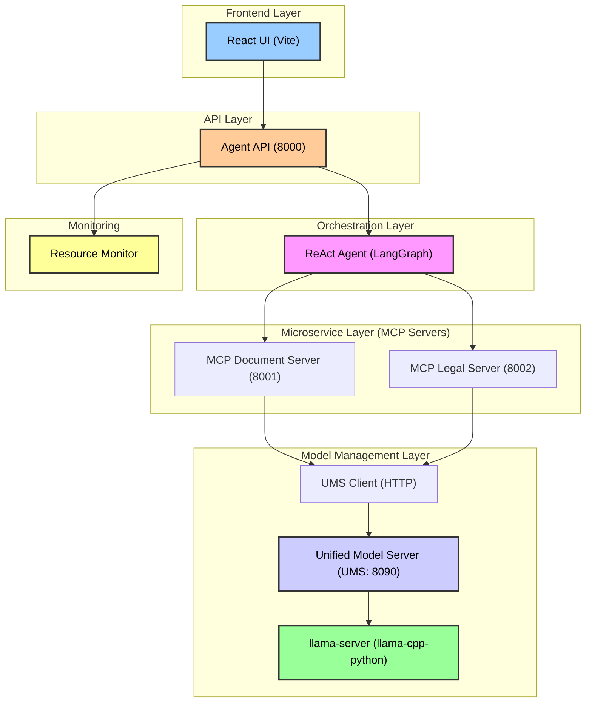

# ReAct Agent Prototype: Microservice Architecture for Document Analysis

Этот прототип демонстрирует переход от монолитной архитектуры к микросервисной для агентной системы обработки документов. Он реализует концепцию **Unified Model Server (UMS)** для эффективного управления ресурсами на одной машине.

Проект использует **LangGraph** для оркестрации, **FastAPI** для создания независимых сервисов (MCP-серверов) и **llama-cpp-python** для инференса локальных моделей.

## Архитектура



### Ключевые компоненты

| Компонент | Файл | Порт | Роль |
| :--- | :--- | :--- | :--- |
| **React UI** | `src/` | - | Интерфейс пользователя (чат, настройки, мониторинг) |
| **Agent API** | `agent_api.py` | 8000 | FastAPI wrapper с SSE стримингом ReAct-шагов |
| **ReAct Agent** | `react_agent_http.py` | - | Главный оркестратор (LangGraph) |
| **Document Server** | `mcp_document_server.py` | 8001 | Сервис для работы с документами (загрузка, чанкинг, OCR) |
| **Legal Server** | `mcp_legal_server.py` | 8002 | Сервис для юридического анализа (сравнение, анализ изменений) |
| **Resource Monitor** | `resource_monitor.py` | - | Мониторинг VRAM, RAM, CPU, CUDA через psutil и pynvml |
| **UMS Client** | `ums_client.py` | - | HTTP-клиент для UMS |
| **UMS** | `unified_model_server.py` | 8090 | Динамическое управление моделями и VRAM |

## Особенности реализации

1. **Agent API с SSE стримингом:** Реальное время отображения ReAct-шагов (Thought → Action → Observation) в UI.
2. **Мониторинг ресурсов:** Отслеживание VRAM, RAM, CPU через `psutil` и `pynvml` с проверкой CUDA.
3. **Динамическое управление моделями (UMS):** Загрузка/выгрузка моделей по требованию для оптимизации VRAM.
4. **Режимы работы:** GPU, CPU и Hybrid (`--n_gpu_layers`) для адаптации к оборудованию.

## Требования

- Python 3.11+
- NVIDIA GPU с CUDA (рекомендуется RTX 3060 12GB или выше)
- Node.js 18+ (для UI)

## Установка

### Backend

```bash
# 1. Перейти в директорию прототипа
cd react_agent_prototype

# 2. Создать виртуальное окружение
python3.11 -m venv venv
source venv/bin/activate  # Linux/Mac
# или: venv\Scripts\activate  # Windows

# 3. Установить зависимости
pip install -r requirements.txt

# 4. Для GPU поддержки (опционально, но рекомендуется)
pip install pynvml
```

### Frontend

```bash
# В корне проекта
npm install
npm run dev
```

## Запуск

### Вариант 1: Полный запуск всех сервисов

```bash
# Терминал 1: Agent API (главный сервер)
cd react_agent_prototype/orchestrator
python agent_api.py
# Доступен на http://localhost:8000

# Терминал 2: Document Server
cd react_agent_prototype/services/document_server
uvicorn mcp_document_server:app --host 0.0.0.0 --port 8001

# Терминал 3: Legal Server
cd react_agent_prototype/services/legal_server
uvicorn mcp_legal_server:app --host 0.0.0.0 --port 8002

# Терминал 4: UMS (если нужны LLM)
cd react_agent_prototype/services/model_manager
python unified_model_server.py

# Терминал 5: Frontend
npm run dev
```

### Вариант 2: Автоматический запуск с тестом

```bash
cd react_agent_prototype
python3.11 test_system.py
```

### Вариант 3: Через tmux

```bash
cd react_agent_prototype
./run_all.sh
```

## API Endpoints

### Agent API (порт 8000)

| Метод | Endpoint | Описание |
| :--- | :--- | :--- |
| GET | `/health` | Статус всех сервисов |
| GET | `/status` | Информация о ресурсах (VRAM, RAM, CPU, CUDA) |
| GET | `/resources` | Детальная информация о системных ресурсах |
| GET | `/cuda` | Проверка поддержки CUDA |
| POST | `/agent/chat` | Отправка запроса агенту |
| GET | `/agent/stream/{session_id}` | SSE стриминг ReAct-шагов |

### Пример использования

```bash
# Проверка здоровья
curl http://localhost:8000/health

# Проверка CUDA
curl http://localhost:8000/cuda

# Получение ресурсов
curl http://localhost:8000/resources

# Отправка запроса агенту
curl -X POST http://localhost:8000/agent/chat \
  -H "Content-Type: application/json" \
  -d '{"query": "Загрузи документ /tmp/test.pdf"}'
```

## Структура проекта

```
.
├── README.md
├── requirements.txt
├── .gitignore
├── run_all.sh
├── test_system.py
├── orchestrator/
│   ├── agent_api.py              # FastAPI wrapper для агента (НОВЫЙ)
│   └── react_agent_http.py       # ReAct Agent (LangGraph)
├── services/
│   ├── resource_monitor.py       # Мониторинг ресурсов (НОВЫЙ)
│   ├── document_server/
│   │   └── mcp_document_server.py
│   ├── legal_server/
│   │   └── mcp_legal_server.py
│   └── model_manager/
│       ├── unified_model_server.py
│       ├── ums_client.py
│       └── models_config.py
└── REQUIREMENTS_ANALYSIS.md
```

## Конфигурация моделей

Модели настраиваются через переменные окружения:

```bash
export MODEL_PATH_QWEN14B="/models/Qwen2.5-14B-Instruct-Q4_K_M.gguf"
export MODEL_PATH_QWENVL="/models/Qwen3-VL-8B-Instruct-Q4_K_M.gguf"
export MODEL_PATH_LABSE="/models/LaBSE-Q4_K_M.gguf"
export MMPROJ_PATH="/models/mmproj-Qwen3-VL-8B-Instruct-F16.gguf"
```

## Следующие шаги

1. **RAG система:** Добавление vector store на LaBSE эмбеддингах
2. **Загрузка файлов:** Endpoint /upload в бэкенде и drag-and-drop в UI
3. **Профили серверов:** Сохранение пресетов подключения
4. **vLLM интеграция:** Поддержка моделей с большим контекстом (32K+)
5. **Docker:** Контейнеризация всех сервисов
